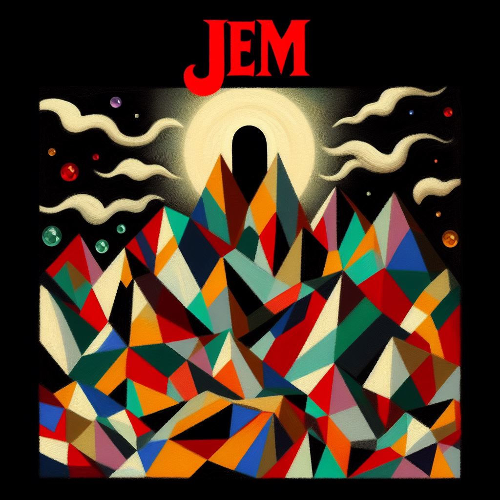

# JEM

  

# About
* Welcome to the repository of our FORTH interpreter, a project proudly brought to you by Team JEM. This project is an implementation of a FORTH interpreter written in C. Project features, contributors, and other information are listed below. Enjoy!

## Features
  * Token Directory: Contains functionality related to parsing and processing tokens.
  * Stack Directory: Includes operations for stack manipulation.
  * Hashtable Directory: Implements hashtable data structure and operations.
  * Linked Executable in Hashtable Main: Executable linked with the main file in the hashtable directory.
  * Support for Constants: Implementation to handle constants in Forth.
  * Partial User Interface: Basic user interface functionality is implemented.

## Growing JEM Forth 
   * Add support for user defined functions
     * conditionals
     *  loops/recursion

## Contributors: 
* Jazmin Camacho, Emma McBride, Morgan Burch

